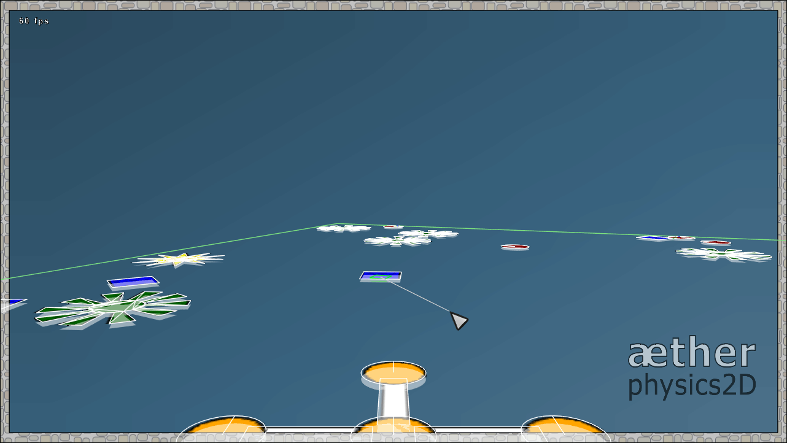
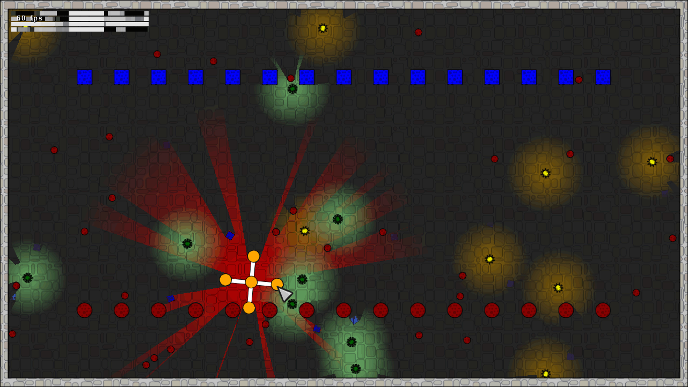

# Aether.Physics2D

Aether.Physics2D is a 2D collision detection system.

Documentation: https://tainicom.github.io/Aether.Physics2D/

# Features

- Continuous collision detection (with time of impact solver)
- Contact callbacks: begin, end, pre-solve, post-solve
- Convex and concave polyons and circles.
- Multiple shapes per body
- Dynamic tree and quad tree broadphase
- Fast broadphase AABB queries and raycasts
- Collision groups and categories
- Sleep management
- Friction and restitution
- Stable stacking with a linear-time solver
- Revolute, prismatic, distance, pulley, gear, mouse joint, and other joint types
- Joint limits and joint motors
- Controllers (gravity, force generators)
- Tools to decompose concave polygons, find convex hulls and boolean operations
- Factories to simplify the creation of bodies
- Fluid dynamics

# Downloads

https://www.nuget.org/packages/Aether.Physics2D

**NOTE** From v1.5 the nuget package `Aether.Physics2D` contain the standalone library 
with no dependencies to 3rd party math libraries. For the monogame library (Vector2, Vector3 etc)
and the monogame based diagnostics use `Aether.Physics2D.MG` and `Aether.Physics2D.Diagnostics.MG`.

https://www.nuget.org/packages/Aether.Physics2D.MG

https://www.nuget.org/packages/Aether.Physics2D.Diagnostics.MG

https://www.nuget.org/packages/Aether.Physics2D.Diagnostics
 

https://github.com/tainicom/Aether.Physics2D/releases/tag/v1.6

